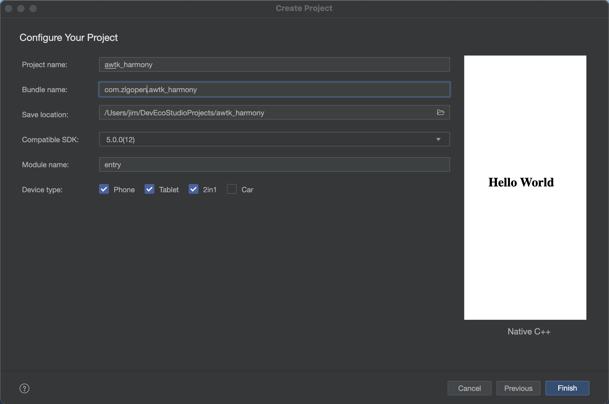
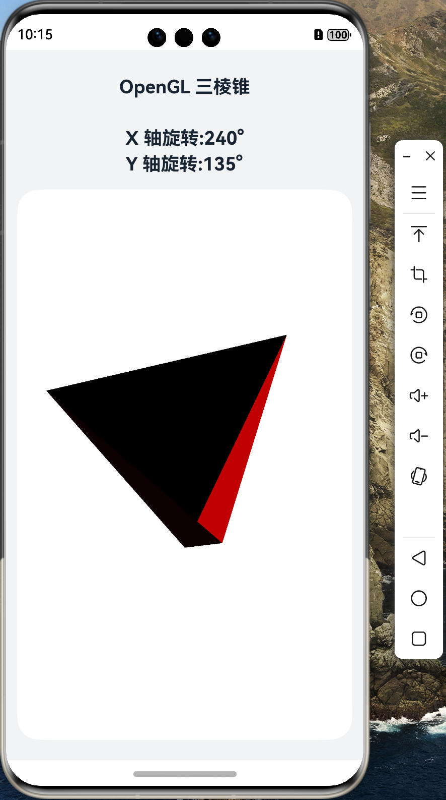

# 移植 AWTK 到 纯血鸿蒙 (HarmonyOS NEXT) 系统 (1) - 让 OpenGLES 应用跑起来

在正式移植 AWTK 之前，我们先尝试在 HarmonyOS 上运行一个简单的 OpenGLES 应用程序。虽然可以确定这一步肯定是可行的，但是作为一个 HarmonyOS NEXT 新手，还是先从简单的应用程序开始，把坑都踩一遍，遇到问题比较好解决。

HarmonyOS 本身带的有 [OpenGLES 的例子](https://gitee.com/openharmony/applications_app_samples.git)，但是用最新的 DevEco Studio 打开，编译时有几个问题。先是找不到  SDK，安装了 SDK，又出现其它问题，最后懒得折腾了。直接新建一个 Native 应用，然后将代码拷贝过去。

## 1. 新建 Native 应用



## 2. 拷贝下列文件

1. 从 applications_app_samples/code/BasicFeature/Native/NdkOpenGL 项目中拷贝下列文件到新项目对应目录：

```
	entry/src/main/cpp/app_napi.cpp
	entry/src/main/cpp/include/
	entry/src/main/cpp/module.cpp
	entry/src/main/cpp/napi_manager.cpp
	entry/src/main/cpp/napi_util.cpp
	entry/src/main/cpp/tetrahedron.cpp
	entry/src/main/ets/utils/
	entry/src/main/resources/base/element/float.json
	entry/src/main/resources/base/media/icon.png

	entry/src/main/cpp/CMakeLists.txt
	entry/src/main/ets/entryability/EntryAbility.ets
	entry/src/main/ets/pages/Index.ets
	entry/src/main/resources/base/element/color.json
	entry/src/main/resources/base/element/string.json
	entry/src/main/resources/en_US/element/string.json
	entry/src/main/resources/zh_CN/element/string.json
```

2. 修改 entry/src/main/cpp/CMakeLists.txt，将动态库的名字改成 awtk_napi
	
3. 修改 entry/src/main/cpp/types/libentry/Index.d.ts

```ts
//传入 x，y 偏移量并返回 x，y 旋转角
export const updateAngle:(offsetX:number, offsetY:number)=>Array;
```

4. 修改 entry/src/main/cpp/types/libentry/oh-package.json5

```json
{
  "name": "libentry_napi.so",
  "types": "./Index.d.ts",
  "version": "1.0.0",
  "description": "entry for harmony."
}
```

## 3. 编译并运行

可以看到一个简单的 OpenGL 应用。



通过这个简单的应用程序，熟悉了 HarmonyOS NEXT 的开发流程，心里有底了，接下来就可以开始移植 nanovg 了。