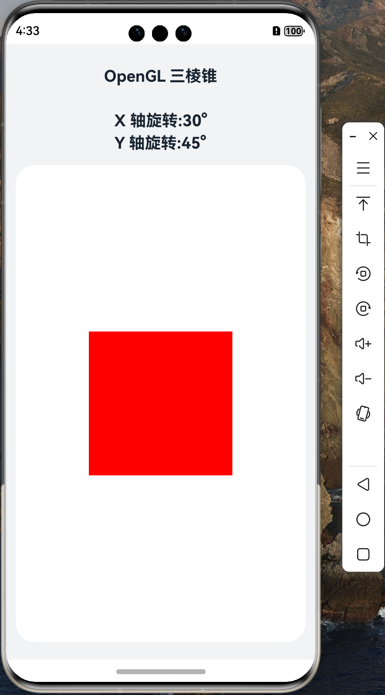

# 移植 AWTK 到 纯血鸿蒙 (HarmonyOS NEXT) 系统 (2) - 移植 nanovg

[AWTK](https://gitee.com/zlgopen/awtk) 使用 [nanovg](https://github.com/memononen/nanovg) 作为显示的后端，能否将 nanovg 成功移植到 HarmonyOS 上是一个关键问题，所以我们先尝试移植 nanovg，不过实际情况比预想的要简单，整个过程没有遇到任何意外的问题。

## 1. 将 AWTK 的代码取到 entry/src/main/cpp 目录下。

```shell
entry/src/main/cpp
git clone https://gitee.com/zlgopen/awtk.git
```

## 2. 修改 CMakeLists.txt

主要下面的改动：

* 添加头文件路径
* 添加源文件
* 设置编译选项。

完整 CMakeLists.txt 如下：

```cmake

# the minimum version of CMake.
cmake_minimum_required(VERSION 3.4.1)

# project
project(awtk_napi)

set(NATIVE_ROOT_PATH ${CMAKE_CURRENT_SOURCE_DIR})
set(AWTK_3RD_PATH ${NATIVE_ROOT_PATH}/awtk/3rd)
set(AWTK_SRC_PATH ${NATIVE_ROOT_PATH}/awtk/src)

# include directory
include_directories(${NATIVE_ROOT_PATH}
                    ${AWTK_3RD_PATH}
                    ${AWTK_SRC_PATH}
                    ${AWTK_3RD_PATH}/nanovg/base
                    ${AWTK_3RD_PATH}/nanovg/gl
                    ${NATIVE_ROOT_PATH}/include
                    ${NATIVE_ROOT_PATH}/include/util)

set(AWTK_FLAGS "-DNANOVG_GLES3=1 -DNANOVG_GL_IMPLEMENTATION=1 ")
set(CMAKE_C_FLAGS "${AWTK_FLAGS}")
set(CMAKE_CXX_FLAGS "${AWTK_FLAGS}")

# build shared library
add_library(awtk_napi SHARED
            awtk/3rd/nanovg/base/nanovg.c
            module.cpp
            app_napi.cpp
            tetrahedron.cpp
            napi_manager.cpp
            napi_util.cpp)

# link OpenHarmony native library （Use OpenGL）
target_link_libraries(awtk_napi PUBLIC EGL)
target_link_libraries(awtk_napi PUBLIC GLESv3)
target_link_libraries(awtk_napi PUBLIC hilog_ndk.z)
target_link_libraries(awtk_napi PUBLIC ace_ndk.z)
target_link_libraries(awtk_napi PUBLIC ace_napi.z)
target_link_libraries(awtk_napi PUBLIC libc++.a)
target_link_libraries(awtk_napi PUBLIC z)
target_link_libraries(awtk_napi PUBLIC uv)
target_link_libraries(awtk_napi PUBLIC libace_napi.z.so)
```

## 3. 修改 tetrahedron.cpp/tetrahedron.h 加入 nanovg 的绘制代码

* 修改头文件
  
```h
#include "nanovg.h"
#include "nanovg_gl.h"

class Tetrahedron {
public:
    explicit Tetrahedron(std::string& id) : id(id) {}; 
    int32_t Init(void* windowHandle, int windowWidth, int windowHeight);
    void Update(float angleXOffset, float angleYOffset);
    float GetAngleX(void);
    float GetAngleY(void);
    int32_t Quit(void);

    
public:
    std::string id; 
    NVGcontext* vg; 
private:
    GLuint LoadShader(GLenum type, const char *shaderSrc);
    GLuint CreateProgram(const char *vertexShader, const char *fragShader);

    EGLNativeWindowType mEglWindow;
    EGLDisplay mEGLDisplay = EGL_NO_DISPLAY;
    EGLConfig mEGLConfig = nullptr;
    EGLContext mEGLContext = EGL_NO_CONTEXT;
    EGLContext mSharedEGLContext = EGL_NO_CONTEXT;
    EGLSurface mEGLSurface = nullptr;
    GLuint mProgramHandle;
    float angleX = 30.0; /* default X angle */
    float angleY = 45.0; /* default Y angle */

    GLint mRotationLocation;
    GLint mTranslationLocation;
    GLint mMoveOriginLocation;
    int w;
    int h;
};
```

* 初始化 nanovg

HardmonyOS NEXT 使用的是 OpenGL ES 3.0，所以我们使用 `nvgCreateGLES3` 函数。

```cpp
    this->w = width;
    this->h = height;
    this->vg = nvgCreateGLES3(NVG_ANTIALIAS | NVG_STENCIL_STROKES);
```    

* 绘制代码

这里我们绘制一个红色的矩形。

```cpp
  nvgBeginFrame(vg, w, h, 1, NVG_ORIENTATION_0);
  nvgBeginPath(vg);

  nvgFillColor(vg, nvgRGBA(255, 0, 0, 255));
  nvgRect(vg, w/4, h/4, w/2, h/2);
  nvgFill(vg);
    
  nvgEndFrame(vg);
```

* 销毁 nanovg

```cpp
    nvgDeleteGLES3(vg);
```

## 4. 编译并运行

可以看到一个 nanovg 绘制的矩形。

