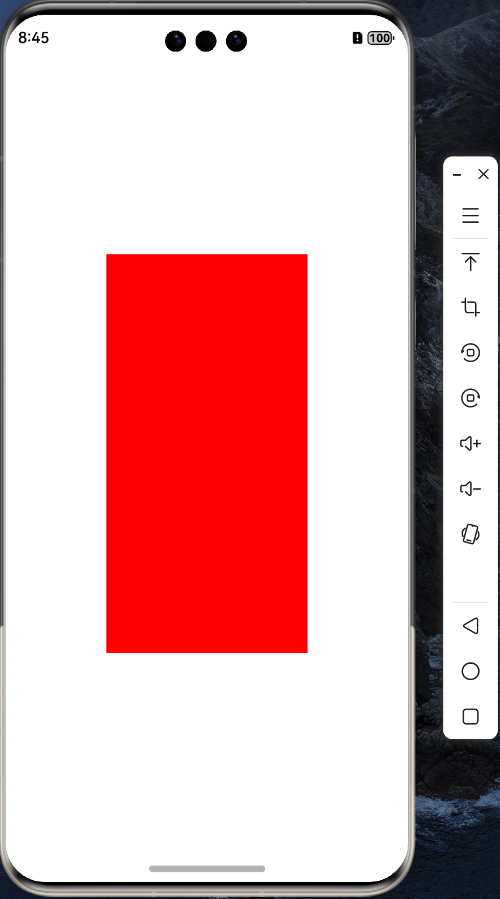

# 移植 AWTK 到 纯血鸿蒙 (HarmonyOS NEXT) 系统 (3) - 增加 awtk_app 类

成功移植 nanovg 之后，心里基本上有底了，我们把之前的代码整理一下，方便后续移植 AWTK。

## 1. 参考 tetrahedron 实现一个 awtk_app 类。

Update 函数非常关键，以后将在这个函数里调用 AWTK 的绘制函数和事件分发。

* awtk_app.h

```h
class AwtkApp {
public:
    explicit AwtkApp(std::string& id) : id(id) {};
    int32_t Init(void* windowHandle, int windowWidth, int windowHeight);
    void Update(void);
    int32_t Quit(void);
    
public:
    std::string id;

private:
    int w;
    int h;
    NVGcontext* vg;
    EGLNativeWindowType mEglWindow;
    EGLDisplay mEGLDisplay = EGL_NO_DISPLAY;
    EGLConfig mEGLConfig = nullptr;
    EGLContext mEGLContext = EGL_NO_CONTEXT;
    EGLContext mSharedEGLContext = EGL_NO_CONTEXT;
    EGLSurface mEGLSurface = nullptr;
};
```

* awtk_app.cpp

```cpp

int32_t AwtkApp::Init(void *window, int32_t width,  int32_t height)
{
    LOGI("Init window = %{public}p, w = %{public}d, h = %{public}d.", window, width, height);
    mEglWindow = reinterpret_cast<EGLNativeWindowType>(window);

    mEGLDisplay = eglGetDisplay(EGL_DEFAULT_DISPLAY);
    if (mEGLDisplay == EGL_NO_DISPLAY) {
        LOGE("unable to get EGL display.");
        return -1;
    }

    EGLint eglMajVers, eglMinVers;
    if (!eglInitialize(mEGLDisplay, &eglMajVers, &eglMinVers)) {
        mEGLDisplay = EGL_NO_DISPLAY;
        LOGE("unable to initialize display");
        return -1;
    }

    int version = 3;
    mEGLConfig = getConfig(version, mEGLDisplay);
    if (mEGLConfig == nullptr) {
        LOGE("GLContextInit config ERROR");
        return -1;
    }

    EGLint winAttribs[] = {EGL_GL_COLORSPACE_KHR, EGL_GL_COLORSPACE_SRGB_KHR, EGL_NONE};
    if (mEglWindow) {
        mEGLSurface = eglCreateWindowSurface(mEGLDisplay, mEGLConfig, mEglWindow, winAttribs);
        if (mEGLSurface == nullptr) {
            LOGE("eglCreateContext eglSurface is null");
            return -1;
        }
    }
    
    /* Create EGLContext from */
    int attrib3_list[] = {
        EGL_CONTEXT_CLIENT_VERSION, 2,
        EGL_NONE
    };
    
    mEGLContext = eglCreateContext(mEGLDisplay, mEGLConfig, mSharedEGLContext, attrib3_list);
    if (!eglMakeCurrent(mEGLDisplay, mEGLSurface, mEGLSurface, mEGLContext)) {
        LOGE("eglMakeCurrent error = %{public}d", eglGetError());
    }
    
    this->w = width;
    this->h = height;
    this->vg = nvgCreateGLES3(NVG_ANTIALIAS | NVG_STENCIL_STROKES);
    
    LOGI("Init success.");

    return 0;
}

void AwtkApp::Update(void)
{
  nvgBeginFrame(vg, w, h, 1, NVG_ORIENTATION_0); 
  nvgBeginPath(vg);
  nvgFillColor(vg, nvgRGBA(255, 0, 0, 255));
  nvgRect(vg, w/4, h/4, w/2, h/2);
  nvgFill(vg);
  nvgEndFrame(vg);

  eglSwapBuffers(mEGLDisplay, mEGLSurface);
}

int32_t AwtkApp::Quit(void)
{
    EGLBoolean ret = eglDestroySurface(mEGLDisplay, mEGLSurface);
    if (!ret) {
        LOGW("eglDestroySurface failure.");
    }

    ret = eglDestroyContext(mEGLDisplay, mEGLContext);
    if (!ret) {
        LOGW("eglDestroyContext failure.");
    }

    ret = eglTerminate(mEGLDisplay);
    if (!ret) {
        LOGW("eglTerminate failure.");
    }

    mEGLSurface = NULL;
    mEGLContext = NULL;
    mEGLDisplay = NULL;
    nvgDeleteGLES3(vg);
    LOGE("Quit success.");
    return 0;
}
```

## 2. 修改 Index.ets

删除不相关的代码，留下 XComponent 即可，让 XComponent 占满整个界面，绘制工作由 XComponent 负责。

```ts
@Entry
@Component
struct Index {
  private xcomponentId = 'awtk_app';

  async aboutToAppear() {
    Logger.info('aboutToAppear');
    let resourceManager = getContext(this).resourceManager;
  }

  build() {
    Column() {
        XComponent({ id: this.xcomponentId, type: 'surface', libraryname: 'awtk_napi' })
          .onLoad(() => {
            Logger.info('onLoad');
          })
          .width('100%')
          .height('100%')
          .key('awtk_app')
          .onDestroy(() => {
            Logger.info('onDestroy');
          })
          .id('xComponent')
          .backgroundColor(Color.White)
    }
    .width('100%')
    .height('100%')
  }
}
```

## 3. 编译运行

可以看到界面绘制全部由 nanovg 接管：

