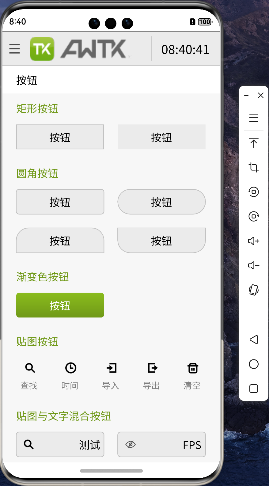

# 移植 AWTK 到 纯血鸿蒙 (HarmonyOS NEXT) 系统 (4) - 平台适配

在移植 AWTK 到 HarmonyOS NEXT 系统之前，我们需要先完成平台适配，比如文件、多线程（线程和同步）、时间、动态库和资源管理。

## 1. 文件

HarmonyOS NEXT 支持标准的 POSIX 文件操作接口，我们可以直接使用下面的代码：

```
src/platforms/pc/fs_os.c
```

## 2. 多线程

HarmonyOS NEXT 支持标准的 POSIX 线程操作接口，我们可以直接使用下面的代码：

```
src/platforms/pc/thread_with_pthread.c
```

## 3. 时间

HarmonyOS NEXT 支持标准的时间函数，我们可以直接使用下面的代码：

```
src/platforms/pc/platform_time.c
```

## 4. 动态库

HarmonyOS NEXT 支持标准的动态库操作接口，我们可以直接使用下面的代码：

```
src/platforms/pc/dl.c
```

## 5. 系统信息

AWTK 需要一些系统信息，比如 屏幕大小、屏幕密度、可写文件目录、临时目录、当前语言、字体缩放比例等。我们可以使用下面的代码从 UIAbilityContext 获取，然后传入到 native 层：

```js
    let context = getContext(this) as common.UIAbilityContext;
    let filesDir: string = context.filesDir;
    let tempDir: string = context.tempDir;
    let resourceManager = context.resourceManager;
    let resourceDir = context.resourceDir;
    let screenDensity: number = context.config.screenDensity || 640;
    let fontScale:number = context.config.fontSizeScale || 1;
    let language:string = context.config.language || "zh_CN";
    awtk_napi.init(resourceManager, filesDir, tempDir, screenDensity, fontScale, language);
```

## 6. 资源管理

资源管理比较麻烦一点，我们参考 AWTK-IOS 将资源打包成一个文件 assets.zip，放到应用程序的包里。在 HarmonyOS NEXT 系统中，我们可以把 assets.zip 放到 rawfile 目录下：

```sh
entry/src/main/resources/rawfile/assets.zip
```

然后通过资源管理器读取：

```cpp
    filename = "assets.zip";
    RawFile *rawFile = OH_ResourceManager_OpenRawFile(mNativeResMgr, filename.c_str());
    if (rawFile != nullptr) {
    }   
    long len = OH_ResourceManager_GetRawFileSize(rawFile);
    assetsData = std::make_unique<uint8_t[]>(len);

    int res = OH_ResourceManager_ReadRawFile(rawFile, assetsData.get(), len);

    OH_ResourceManager_CloseRawFile(rawFile);
    OH_ResourceManager_ReleaseNativeResourceManager(mNativeResMgr);

    assetsZipContent = assetsData.get();
    assetsZipSize = len;
    awtk_app_->Init(filesDir.c_str(), tempDir.c_str(), screenDensity, fontScale, language.c_str(), assetsZipContent, assetsZipSize);
```

## 7. 编译运行

> AWTK 原生窗口和输入事件处理，此时已经实现，不过我们下一篇文章再介绍，先放一张图上来看看：

