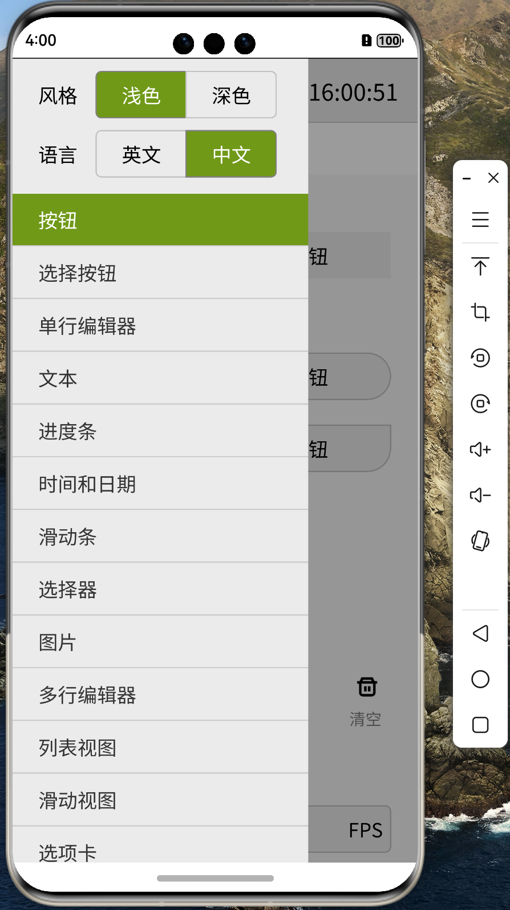

# 移植 AWTK 到 纯血鸿蒙 (HarmonyOS NEXT) 系统 (5) - 原生窗口

AWTK 需要一个 原生窗口(native_window) 接口来抽象窗口系统。主要用于获取窗口的信息、获取画布和提交绘制结果。在 HarmonyOS NEXT 系统中，我们可以使用下面的代码：

## 1. 获取窗口信息

```c
static ret_t native_window_harmony_get_info(native_window_t *win, native_window_info_t *info) {
    system_info_t *s_info = system_info();

    info->x = 0;
    info->y = 0;
    info->w = s_info->lcd_w;
    info->h = s_info->lcd_h;
    info->ratio = s_info->device_pixel_ratio;

    log_debug("ratio=%f %d %d\n", info->ratio, info->w, info->h);

    return RET_OK;
}
```

## 2. 获取画布对象

```c
static canvas_t *native_window_harmony_get_canvas(native_window_t *win) {
    native_window_harmony_t *harmony = NATIVE_WINDOW_HARMONY(win);

    return &(harmony->canvas);
}
```

## 3. 提交绘制结果

```c
static ret_t native_window_harmony_swap_buffer(native_window_t *win) {
    native_window_harmony_t *harmony = NATIVE_WINDOW_HARMONY(win);
    return_value_if_fail(harmony != NULL && harmony->app != NULL, RET_BAD_PARAMS);

    harmony->app->Flush();
    
    return RET_OK;
}

## 4. 创建原生窗口

```c

static native_window_t *native_window_harmony_create_internal(AwtkApp *app) {
    int top = 0;
    int left = 0;
    unsigned int width = 0;
    unsigned int height = 0;
    float devicePixelRatio = 1;

    if (s_shared_win != NULL) {
        TK_OBJECT_REF(s_shared_win);
        return s_shared_win;
    }

    tk_object_t *obj = tk_object_create(&s_native_window_harmony_vtable);
    native_window_t *win = NATIVE_WINDOW(obj);
    native_window_harmony_t *harmony = NATIVE_WINDOW_HARMONY(win);
    canvas_t *c = &(harmony->canvas);
    return_value_if_fail(harmony != NULL, NULL);

    win->shared = TRUE;
    win->vt = &s_native_window_vtable;
    harmony->app = app;
    app->GetMetrics(left, top, width, height, devicePixelRatio);

    width = width / devicePixelRatio;
    height = height / devicePixelRatio;

    system_info_set_lcd_w(system_info(), width);
    system_info_set_lcd_h(system_info(), height);
    system_info_set_device_pixel_ratio(system_info(), devicePixelRatio);
    win->rect = rect_init(left, top, width, height);

    lcd_t *lcd = lcd_harmony_init(win);
    canvas_init(c, lcd, font_manager());

    return win;
}
```

## 5. 销毁原生窗口

```c
static ret_t native_window_harmony_on_destroy(tk_object_t *obj) {
    native_window_harmony_t *harmony = NATIVE_WINDOW_HARMONY(obj);
    lcd_t *lcd = harmony->canvas.lcd;

    canvas_reset(&(harmony->canvas));
    lcd_destroy(lcd);

    return RET_OK;
}
```

