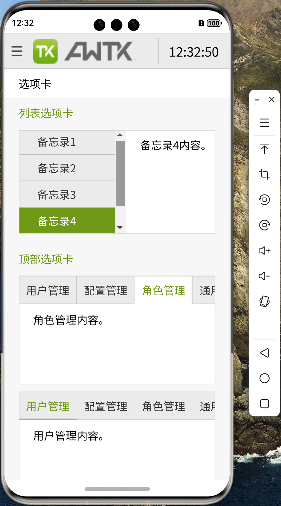

# 移植 AWTK 到 纯血鸿蒙 (HarmonyOS NEXT) 系统 (6) - 触屏事件

AWTK 作为一个GUI引擎，自然少不了对触屏事件的支持。这里我们先支持单点触摸，后续再支持多点手势。

## 1. 注册 XComponent 的触屏事件回调

这个在 `AppNapi` 的构造函数中完成：

```cpp
AppNapi::AppNapi(std::string &id) {
    id_ = id;
    component_ = nullptr;
    auto appCallback = AppNapi::GetNXComponentCallback();
    appCallback->OnSurfaceCreated = OnSurfaceCreatedCB;
    appCallback->OnSurfaceChanged = OnSurfaceChangedCB;
    appCallback->OnSurfaceDestroyed = OnSurfaceDestroyedCB;
    appCallback->DispatchTouchEvent = DispatchTouchEventCB;
    auto appMouseEventCallback = AppNapi::GetNXComponentMouseEventCallback();
    appMouseEventCallback->DispatchMouseEvent = DispatchMouseEventCB;

    awtk_app_ = new AwtkApp(id);
}
```

## 2. 在触屏事件的回调函数中，将事件分发给 awtk_app

> 事件需要根据当前屏幕的缩放比例，转换为 awtk 的坐标系。

```cpp
void AppNapi::DispatchTouchEvent(OH_NativeXComponent *component, void *window) {
    int32_t ret = OH_NativeXComponent_GetTouchEvent(component, window, &touchEvent_);
    if (ret == OH_NATIVEXCOMPONENT_RESULT_SUCCESS) {
        double dpr = awtk_app_->GetDevicePixelRatio();
        int x = touchEvent_.x / dpr;
        int y = touchEvent_.y / dpr;
        int button = 0;

        switch (touchEvent_.type) {
        case OH_NATIVEXCOMPONENT_DOWN: {
            awtk_app_->DispatchPointerDown(button, x, y);
            break;
        }
        case OH_NATIVEXCOMPONENT_MOVE: {
            awtk_app_->DispatchPointerMove(button, x, y);
            break;
        }
        case OH_NATIVEXCOMPONENT_UP: {
            awtk_app_->DispatchPointerUp(button, x, y);
            break;
        }
        default: {
            break;
        }
        }
    } else {
        LOGE("Touch fail");
    }
}
```

## 3. 将事件注入主循环

```cpp
void AwtkApp::DispatchPointerDown(int button, int x, int y) {
    mPressed = true;

    pointer_event_t event;
    widget_t *widget = window_manager();
    pointer_event_init(&event, EVT_POINTER_DOWN, widget, x, y);
    event.pressed = mPressed;
    event.button = button;

    event_queue_req_t r;
    memset(&r, 0x00, sizeof(r));
    r.pointer_event = event;
    main_loop_queue_event(main_loop(), &r);
}
```

## 4. 加入触屏事件支持后，就可以通过触屏操作界面了


