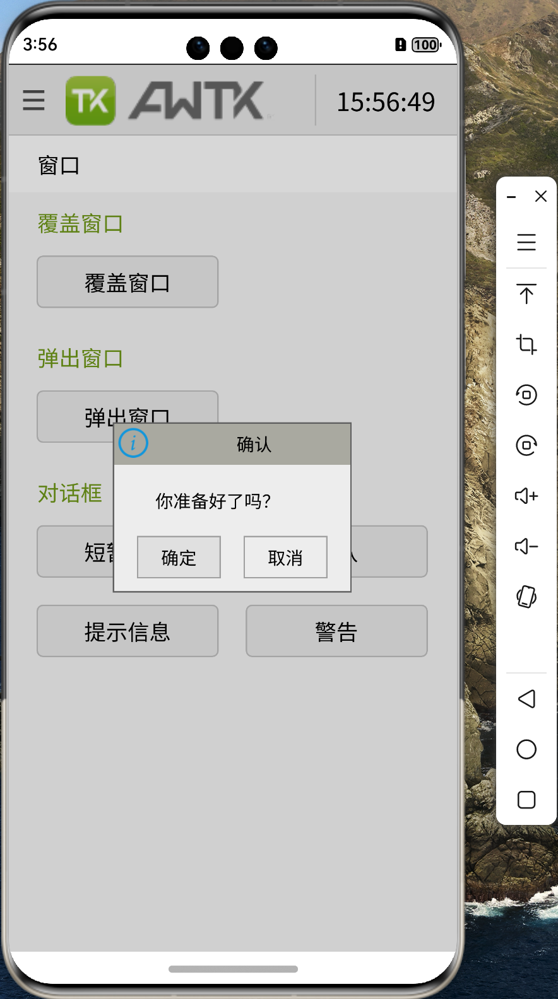

# 移植 AWTK 到 纯血鸿蒙 (HarmonyOS NEXT) 系统 (7) - 主循环

在 AWTK-Android 和 AWTK-IOS 中，使用的 SDL 库，自己分发事件，可以完全控制主循环。但是在 AWTK-HarmonyOS 中，使用的是系统的事件循环，在系统主循环中周期的调用 main\_loop\_step 函数。

## 1. 周期定时器

* 页面显示时，启动周期定时器，调用 awtk\_napi.update 函数。
  
```js
  onPageShow() {
    this.refreshTimerID = setInterval(() => {
      awtk_napi.update();
    }, 16);
  }
```

* 页面隐藏时，清除周期定时器。
  
```js
  onPageHide() {
    clearTimeout(this.refreshTimerID);
    this.refreshTimerID = 0;
  }
```

## 2. 调用 main\_loop\_step 函数

```cpp
void AwtkApp::Update(void) {
    if (mWidth > 0 && mHeight > 0) {
        main_loop_step(main_loop());
    }
}
```

> 这个做法和 AWTK-WEB 中的做法类似，在周期定时器中调用 main\_loop\_step 函数。所以同样有个小问题：无法使用模态对话框，不过问题不大，因为在 AWTK 中，对话框后面的窗口本身就是不可操作的。




