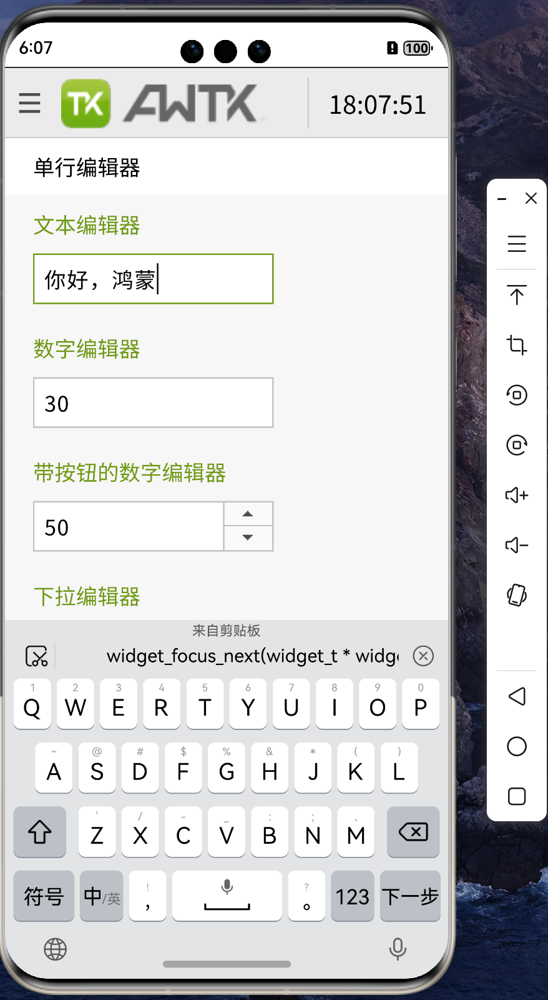
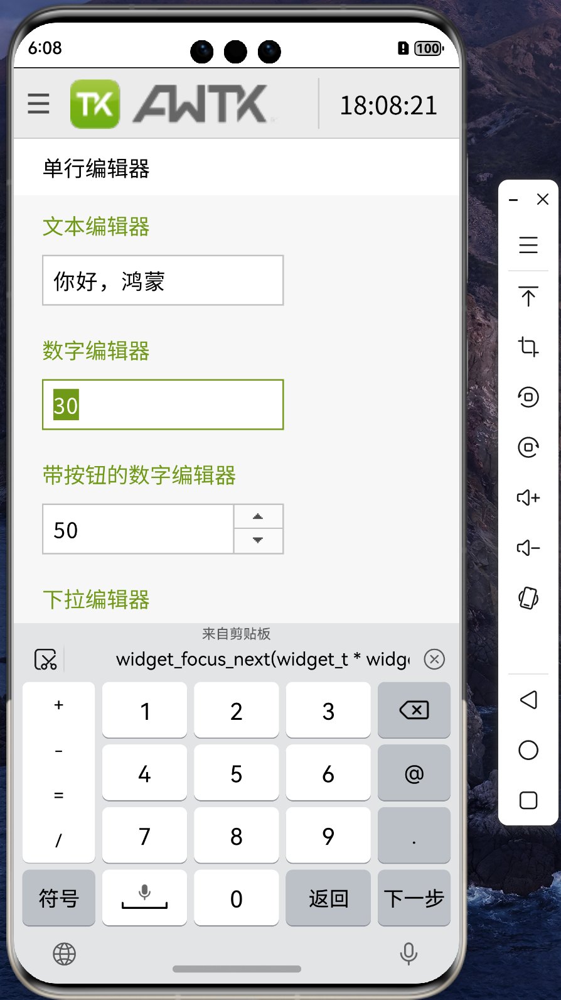
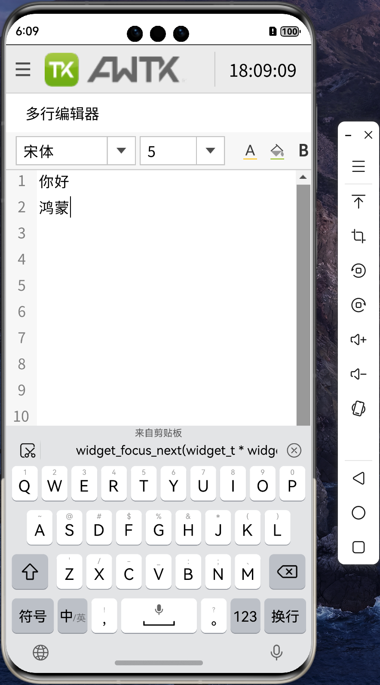

# 移植 AWTK 到 纯血鸿蒙 (HarmonyOS NEXT) 系统 (8) - 原生输入法

AWTK 在嵌入式平台使用内置的输入法，在移动设备上使用系统的原生输入法。在 AWTK-Android 和 AWTK-IOS 中，使用的是 SDL 封装之后的系统原生输入法。在 AWTK-HarmonyOS 中，要使用系统的原生输入法。需要实现 input_method 接口：

## 1. 启动输入法

编辑器得到焦点时，启动输入法。

调用 OH_InputMethodController_Attach 函数启动输入法，注意需要先设置输入法需要的回调函数。

```cpp
static ret_t input_method_harmony_enable(input_method_t *input_method) {
    InputMethod_ErrorCode code = InputMethod_ErrorCode::IME_ERR_OK;
    input_method_harmony_t *im = (input_method_harmony_t *)input_method;
    return_value_if_fail(im != NULL, RET_BAD_PARAMS);
    auto options = OH_AttachOptions_Create(true);
    auto textEditorProxy = OH_TextEditorProxy_CreateAndInit();
    auto inputMethodProxy = &(im->inputMethodProxy);

    code = OH_InputMethodController_Attach(textEditorProxy, options, inputMethodProxy);
    if (code == InputMethod_ErrorCode::IME_ERR_OK) {
        log_debug("attach input method ok\n");
    } else {
        log_warn("attach input method failed\n");
    }

    im->options = options;
    im->textEditorProxy = textEditorProxy;

    return RET_OK;
}
```

## 2. 关闭输入法

编辑器失去焦点时，关闭输入法。

```cpp
static ret_t input_method_harmony_disable(input_method_t *input_method) {
    InputMethod_ErrorCode code = InputMethod_ErrorCode::IME_ERR_OK;
    input_method_harmony_t *im = (input_method_harmony_t *)input_method;
    return_value_if_fail(im != NULL, RET_BAD_PARAMS);

    code = OH_InputMethodController_Detach(im->inputMethodProxy);
    if (code != InputMethod_ErrorCode::IME_ERR_OK) {
        log_warn("Detach input method failed!");
    }
    im->inputMethodProxy = nullptr;
    OH_TextEditorProxy_Destroy(im->textEditorProxy);
    im->textEditorProxy = nullptr;
    OH_AttachOptions_Destroy(im->options);
    im->options = nullptr;

    return RET_OK;
}
```

## 3. 输入法回调

* 获取输入法配置
  
```cpp
static void input_method_harmony_get_text_config(InputMethod_TextEditorProxy *textEditorProxy,
                                                 InputMethod_TextConfig *config) {
    input_method_t *im = input_method();
    return_if_fail(im != NULL && im->widget != NULL);

    input_type_t type = (input_type_t)widget_get_prop_int(im->widget, WIDGET_PROP_INPUT_TYPE, INPUT_TEXT);
    InputMethod_TextInputType harmony_type = IME_TEXT_INPUT_TYPE_TEXT;

    switch (type) {
    case INPUT_TEXT: {
        harmony_type = IME_TEXT_INPUT_TYPE_TEXT;
        break;
    }
    case INPUT_INT:
    case INPUT_UINT: {
        harmony_type = IME_TEXT_INPUT_TYPE_NUMBER;
        break;
    }
    case INPUT_FLOAT:
    case INPUT_UFLOAT: {
        harmony_type = IME_TEXT_INPUT_TYPE_NUMBER_DECIMAL;
        break;
    }
    case INPUT_ASCII: {
        harmony_type = IME_TEXT_INPUT_TYPE_TEXT;
        break;
    }
    case INPUT_DATE:
    case INPUT_TIME:
    case INPUT_CUSTOM:
    case INPUT_TIME_FULL: {
        harmony_type = IME_TEXT_INPUT_TYPE_DATETIME;
        break;
    }
    case INPUT_EMAIL: {
        harmony_type = IME_TEXT_INPUT_TYPE_EMAIL_ADDRESS;
        break;
    }
    case INPUT_CUSTOM_PASSWORD:
    case INPUT_PASSWORD: {
        harmony_type = IME_TEXT_INPUT_TYPE_NEW_PASSWORD;
        break;
    }
    case INPUT_PHONE: {
        harmony_type = IME_TEXT_INPUT_TYPE_PHONE;
        break;
    }
    default: {
        break;
    }
    if (tk_str_eq(im->widget->vt->type, WIDGET_TYPE_MLEDIT)) {
        harmony_type = IME_TEXT_INPUT_TYPE_MULTILINE;
        OH_TextConfig_SetEnterKeyType(config, IME_ENTER_KEY_NEWLINE);
    } else {
        OH_TextConfig_SetEnterKeyType(config, IME_ENTER_KEY_NEXT);
    }
    OH_TextConfig_SetInputType(config, harmony_type);
    OH_TextConfig_SetPreviewTextSupport(config, true);
}
```

* 输入文本
  
```cpp
static ret_t wstr_from_char16(wchar_t *wstr, size_t size, const char16_t *text, size_t length) {
    size_t i = 0;
    for (i = 0; i < length && i < size; i++) {
        wstr[i] = text[i];
    }

    return RET_OK;
}

static void input_method_harmony_insert_text(InputMethod_TextEditorProxy *textEditorProxy, const char16_t *text,
                                             size_t length) {
    char str[512] = {0};
    wchar_t wstr[256] = {0};
    input_method_t *im = input_method();
    return_if_fail(im != NULL && im->widget != NULL);

    memset(wstr, 0x00, sizeof(wstr));
    wstr_from_char16(wstr, ARRAY_SIZE(wstr) - 1, text, length);

    tk_utf8_from_utf16(wstr, str, sizeof(str) - 1);

    input_method_commit_text(im, str);
}
```

* 向前删除文本
  
```cpp
static void input_method_harmony_delete_forward(InputMethod_TextEditorProxy *textEditorProxy, int32_t length) {
    input_method_t *im = input_method();
    return_if_fail(im != NULL && im->widget != NULL);
    input_method_dispatch_key(input_method(), TK_KEY_DELETE);
}
```

* 向后删除文本
  
```cpp
static void input_method_harmony_delete_backward(InputMethod_TextEditorProxy *textEditorProxy, int32_t length) {
    input_method_t *im = input_method();
    return_if_fail(im != NULL);
    input_method_dispatch_key(input_method(), TK_KEY_BACKSPACE);
}
```

* 发送回车键
  
```cpp
static void input_method_harmony_send_enter_key(InputMethod_TextEditorProxy *textEditorProxy,
                                                InputMethod_EnterKeyType enterKeyType) {
    input_method_t *im = input_method();
    return_if_fail(im != NULL && im->widget != NULL);
    switch (enterKeyType) {
    case IME_ENTER_KEY_NEXT: {
        widget_focus_next(im->widget);
        break;
    }
    case IME_ENTER_KEY_PREVIOUS: {
        widget_focus_prev(im->widget);
        break;
    }
    case IME_ENTER_KEY_NEWLINE: {
        input_method_dispatch_key(im, TK_KEY_RETURN);
        break;
    }
    default:
        break;
    }
}
```

## 4. 效果图

* 文本输入
  


* 数字输入



* 多行输入
  


## 5. 已知问题

* 目前只实现了基本功能，部分不常用的回调函数没有实现。

* 鸿蒙系统没有提供设置输入位置的接口，所以在编辑器的位置偏下时，软键盘弹出时不会自动上推窗口，导致编辑器被软键盘遮挡。
