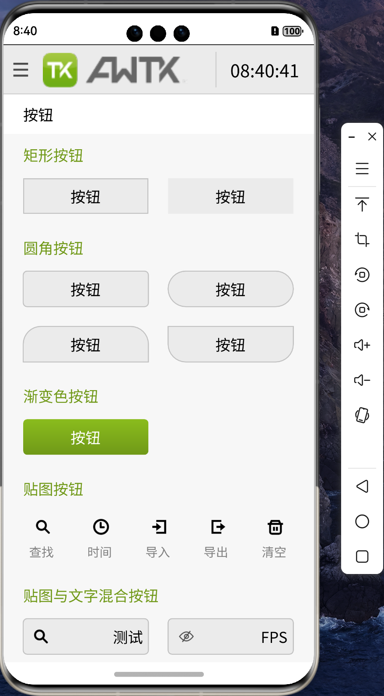
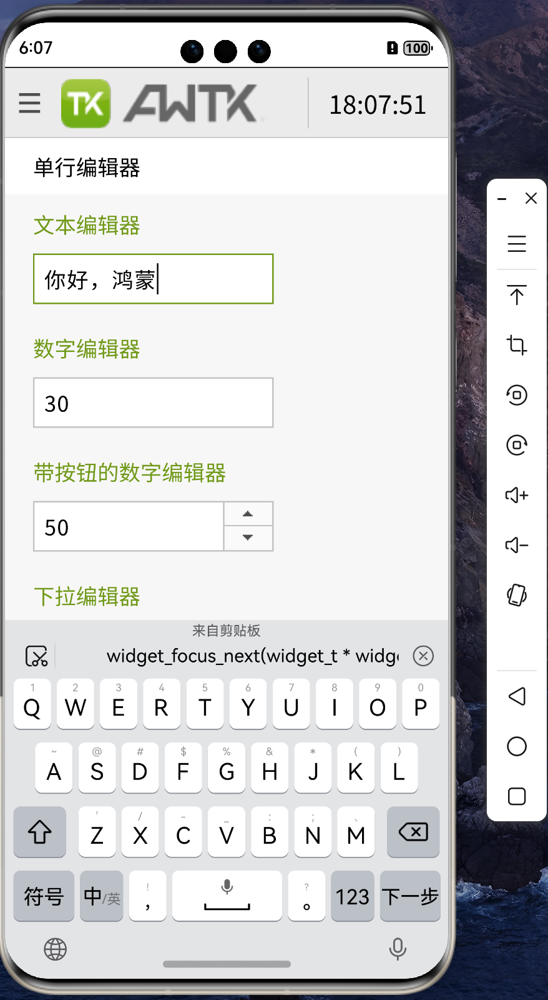
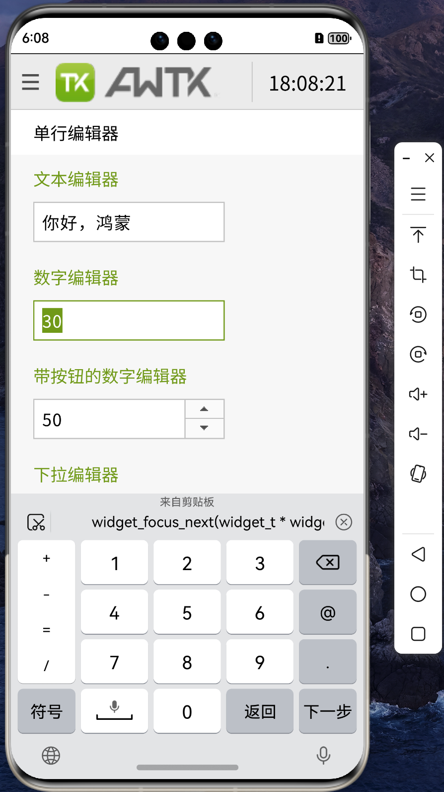

## AWTK-HarmonyOS NEXT 发布

AWTK 全称为 Toolkit AnyWhere，是 ZLG 倾心打造的一套基于 C 语言开发的 GUI 框架。旨在为用户提供一个功能强大、高效可靠、简单易用、可轻松做出炫酷效果的 GUI 引擎，支持跨平台同步开发，一次编程，到处编译，跨平台使用。

HarmonyOS NEXT 是华为公司自研操作系统，2023 年 8 月 4 日发布，该系统是鸿蒙抛弃 Linux 内核及安卓开放源代码项目（AOSP）等代码的首个大版本，该系统仅支持鸿蒙内核和鸿蒙系统的应用，不再兼容安卓应用。10 月 22 日，华为原生鸿蒙 HarmonyOS NEXT 正式发布。

HarmonyOS 是全球第三大移动操作系统，有巨大的市场潜力，除了在手机、平板、电视、汽车广泛使用，可能也会给传统嵌入式行业注入新的活力。在国产替代的背景下，机会多多，将 AWTK 移植到 HarmonyOS 上，可以让 AWTK 开发者也能享受到 HarmonyOS 生态的红利。

* 按钮界面
  

* 文本输入界面
  

* 数字输入界面

代码下载: [AWTK-HarmonyOS NEXT](https://gitee.com/zlgopen/awtk-harmonyos-next)

